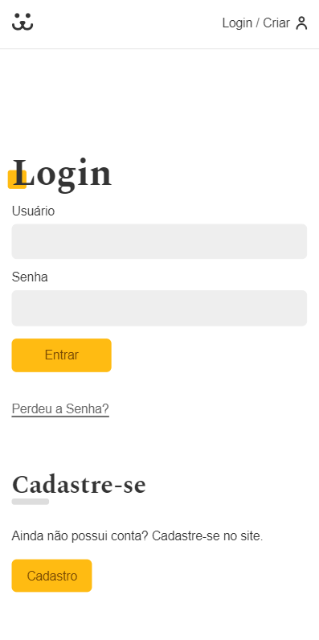

# React Dogs 

> Dogs - Rede social para cachorros, afinal quem não gosta de cachorros?
> <br> projeto desenvolvido durante o [curso de react][curso] da [origamid][origamid].

## Preview

 
 

##### Ver mais [Desktop][desktop], [Mobile][mobile].

## Como usar?

Primeiramente clone o projeto

```sh
git clone https://github.com/AllanHSZ/ReactDogs.git
```

Entre na pasta do projeto

```sh
cd ReactDogs
```

Instale as dependências

```sh
yarn install   ou    sh npm install
```

E por fim. inicie o projeto.

```sh
yarn start   ou   sh npm start
```

[desktop]: https://github.com/AllanHSZ/ReactDogs/tree/master/preview
[mobile]: https://github.com/AllanHSZ/ReactDogs/tree/master/preview/mobile
[origamid]: https://www.origamid.com/
[curso]: https://www.origamid.com/curso/react-completo/
